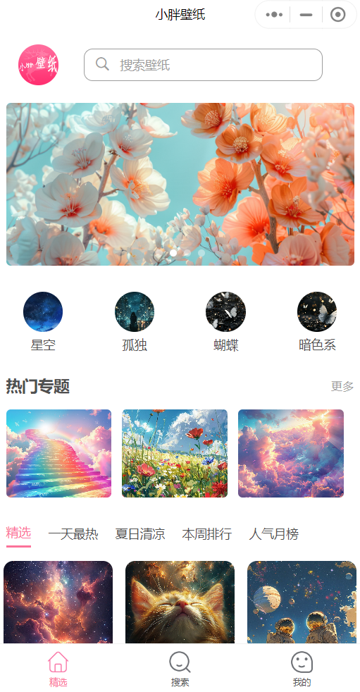

**小胖壁纸-微信小程序** 

小胖壁纸 是一个 基于 uni-app 开发的微信小程序，使用Django Admin 搭建后端服务；可配置微信流量主；

 **需要修改内容** 

1. 小程序key需要修改为自己的：在manifest.json中mp-weixin-appid
2. 接口配置地址需要修改为自己的：
    common->api->index 中 basehost，对应的接口调用地址需要按照自己的接口地址进行修改；

 **直接扫码体验：** 

 **部分预览图（详情请扫描上面小程序码）：** 

|    |    |    |    |
|---|---|---|---|
|   |   | |  |

 **Django Admin管理系统**

用来管理该小程序数据；
| |
|--|

有问题沟通、交流、咨询可加作者Q：1500061539 V：jeep-xp003 请备注来源；

有收获可以请作者喝一杯：

转载请署名作者，不得作为商业用途，禁止售卖。[协议](https://gitee.com/xpangza/xp-wallpaper/blob/main/LICENSE#)
